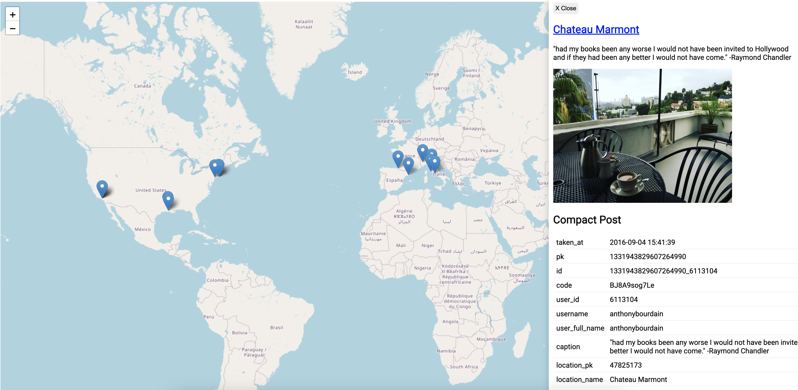

# `instagraper`

Scrape instagram profile posts including the corresponding locations. It can preform cleaning and produce json, geojson or leaflet map outputs.

It can be used as a [python package](#python-package) or as a [CLI tool](#cli).

# Example

**Installation**

```console
 pip install instagraper[cli]
```

**Usage**

```console
instagraper anthonybourdain --x-ig-app-id your-ig-app-id --session-id your-session-id --map --images
```

which creates the following example map (in `anthonybourdain.html`), with each location plotted, the corresponding instagram post details and link:


# Authentication

To use this tool, you need to get the instagram app id and session id and set them as environment variables (`X_IG_APP_ID` and `SESSION_ID`, as shown on [`.env.example`](.env.example)) or pass them as variables for both the python package or the CLI tool.

This variables can be extracted from the developer tools, saved locally on your machine and they will last for a long time:

1. In your browser, navigate to [instagram](https://www.instagram.com/) and authenticate
2. open the developer tools (right click on some blank space on the webpage and click "Inspect")
3. To get the `X_IG_APP_ID` variable, go to the `Elements` tab, press `CTRL+F` (or `CMD+F`) and search for `X-IG-App-ID`. You should see a large number next to it - copy it and save it.
4. To get the `SESSION_ID` variable, go to the `Application` tab > `Cookies` > `https://www.instagram.com` > and search for `sessionid`. copy it's value and save it.

## Python package

### Installation

```bash
pip install "instagraper"
```

### Usage

as mentioned in [authentication](#authentication), you need 2 keys to authenticate through instagram. They can be saved as environment variables or passed as parameters, like this:

```python
import instagraper
posts = instagraper.scrape(x_ig_app_id="your-x-ig-app-id", session_id="your-session-id")
```

In the following examples, it's assumed that this variables were saved as environment variables.

#### Get posts

returns a list of `Post` dataclass defined [here](./instagraper/models.py).

```python
import instagraper

posts = instagraper.scrape("anthonybourdain", compact=True)
print(posts)
"""
[
    Post(
        taken_at=datetime.datetime(2018, 6, 4, 11, 48, 9),
        username='anthonybourdain',
        caption='Light lunch. #Alsace',
        lng=11.25,
        lat=43.7833,
        image_url='https://scontent-lhr6-1.cdninstagram.com/v/t51...',
        pk='1794233220902862216',
        id='1794233220902862216_6113104',
        code='BjmZZuwHr2I',
        user_id='6113104',
        ...
    ),
    ...
]
"""
```

#### Dump posts into a json file

```python
import instagraper
# in raw format
instagraper.scrape("anthonybourdain", json_output="anthonybourdain_posts.json")
# creates the "anthonybourdain_posts.json" file

# in compact format
instagraper.scrape("anthonybourdain", compact=True, json_output="anthonybourdain_compact_posts.json")
# creates the "anthonybourdain_compact_posts.json" file
```

#### Dumps posts into geojson

Creates geojson points with the posts that have a location (lat and lng).

```python
import instagraper

instagraper.scrape("anthonybourdain", geojson_output="anthonybourdain_posts.geojson")
# creates the "anthonybourdain_posts.geojson" file

```

#### Creates map with locations

Creates a leaflet map which uses the generated geojson file. If not provided, the geojson_output file is created with the corresponding username as it's file name.

```python
import instagraper

# with a geojson output
instagraper.scrape("anthonybourdain", geojson_output="anthonybourdain_posts.geojson", map_output="anthonybourdain.html")
# creates the "anthonybourdain.html" and "anthonybourdain_posts.geojson" files.

# without a geojson output it still creates one, using the username as the default file name
instagraper.scrape("anthonybourdain", map_output="anthonybourdain.html")
# creates the "anthonybourdain.html" and "anthonybourdain.geojson" files.
```

It's also possible to download each post image, so it's path is saved in the geojson file and plotted in the map:

```python
import instagraper

instagraper.scrape("anthonybourdain", map_output="anthonybourdain.html", with_images=True)
# creates an "images" directory with each post cover image
```

## CLI

To use the CLI program, you need to install it first:

```bash
pip install "instagraper[cli]"
```

### Usage:

as mentioned in [authentication](#authentication), you need 2 keys to authenticate through instagram. They can be saved as environment variables or passed as CLI options.

```console
$ instagraper USERNAME [OPTIONS]
```

#### Arguments:

```console
 *    username      TEXT  The Instagram username to scrape posts from. [default: None] [required]    
```

#### Options:
```console

--x-ig-app-id                 TEXT     Instagram app id (x-ig-app-id) header to authenticate the requests. If not provided, the tool will try to read it from the environment variable X_IG_APP_ID [default: None] 
--session-id                  TEXT     Instagram session id (sessionid) cookie to authenticate the requests. If not provided, the tool will try to read it from the environment variable SESSION_ID [default: None] 
--compact             -c               Wether to cleanup the scraped posts [default: True]                                  
--json                -j      TEXT     The file name to save the scraped posts in JSON format. The file path will be {target}/{json_output}. [default: None]        
--geojson             -g      TEXT     The file name to save the scraped posts in GeoJSON format. If map is enabled, it will be used as the input file for the map and will default to {username}.geojson. The file path will be {target}/{geojson_output}. [default: None]
--map                 -m      TEXT     The html file name to save the generated map. The file path will be {target}/{map_output}. [default: None]                                                   
--target              -t      TEXT     the target path/directory to save the output files. Defaults to a directory with the instagram username as it's name, e.g ./{username}/ [default: None]    
--images              -i               whether to download post's images or not. The images will be saved in the {target}/images directory.   
--static-url          -s      TEXT     The static url/path where the target directory will be hosted. Used to serve the images for the geojson output. e.g. if https://example.com/instagraper/ images will be in https://example.com/instagraper/{target}/images/      [default: None]
--limit               -l      INTEGER  The maximum number of posts to scrape. If not provided, all posts will be scraped. [default: None]     
--install-completion                   Install completion for the current shell.   
--show-completion                      Show completion for the current shell, to copy it or customize the installation.                                         
--help                                 Show this message and exit.                 
```

### Examples

1. To use the tool with default settings (compact JSON output), you just need to provide the Instagram username:

```bash
instagraper anthonybourdain
```

2. To dump the posts to a json file named `anthonybourdain.json`

```bash
instagraper anthonybourdain -j
```

3. To dump the posts to a geojson file named `anthonybourdain.geojson`

```bash
instagraper anthonybourdain -g
```

3. To create a map (`anthonybourdain.html`) that plots each post's location:

```bash
instagraper anthonybourdain -m
```

This will also create the above mentioned geojson file.

4. To also download images when creating the geojson file or map:

```bash
instagraper anthonybourdain -g -i
```
